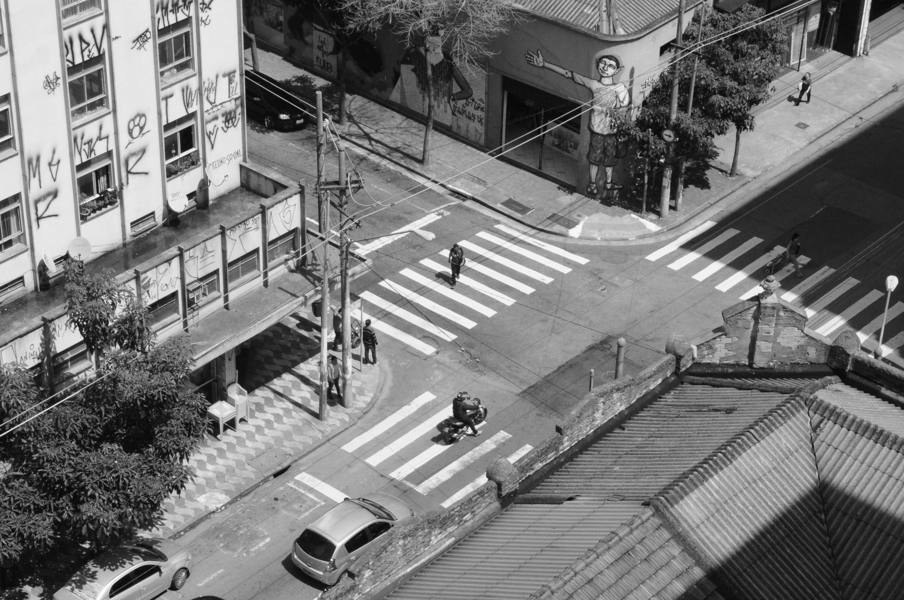
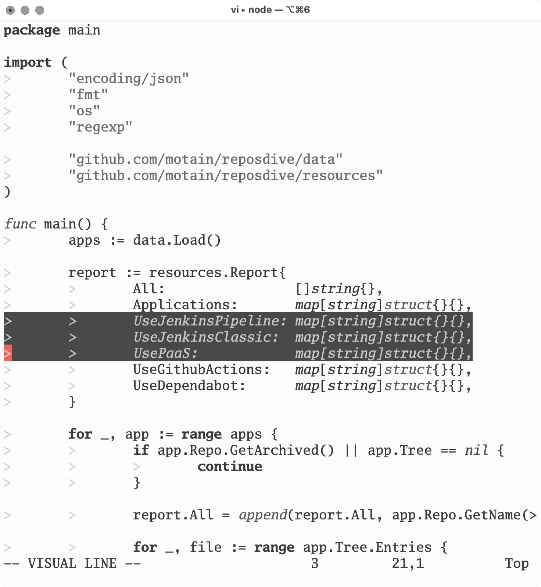
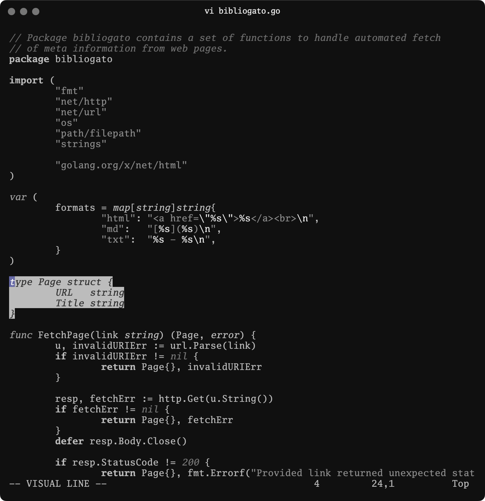
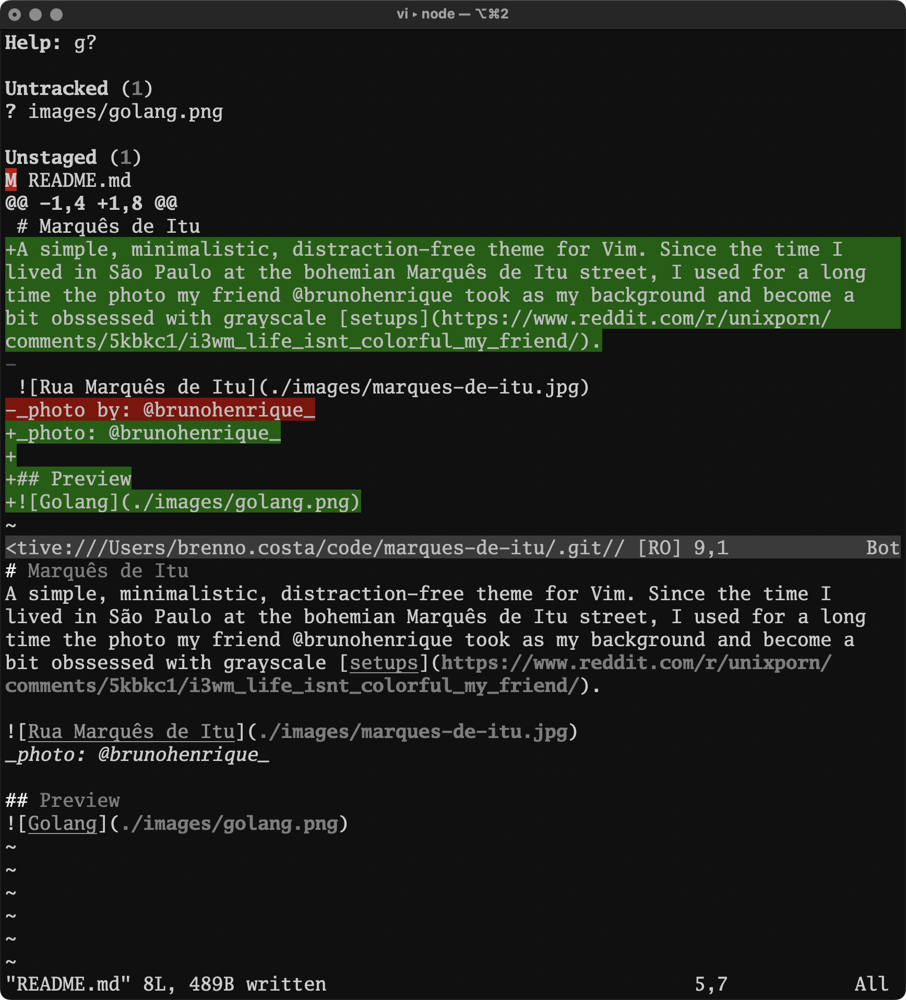

# Marquês de Itu

A simple, minimalistic, distraction-free theme for Vim. During my time living on the bohemian Marquês de Itu street in São Paulo, I used this photo by my friend @brunohenrique as my background for a long time and became obsessed with greyscale [setups](https://www.reddit.com/r/unixporn/comments/5kbkc1/i3wm_life_isnt_colorful_my_friend/) when I saw my other friend @cairesvs and his monochromatic editor ­ it was the perfect match.


_photo: @brunohenrique_

## Technical details

This is a 256-color theme. These days I try to use as vanilla a setup as possible, so I rely on Terminal.app, which only supports 256 colors.

It support light and dark background, your terminal should set the background color accordingly.

## Installation

### Vim

```
git clone https://github.com/brennovich/marques-de-itu.git ~/.vim/pack/plugins/start/marques-de-itu
```

Then set the colorscheme in your `.vimrc`:

```vim
colorscheme marques-de-itu
```

### Ghostty

Turns out I'm trying Ghostty, so I added basic support for it. Copy the theme file to your Ghostty themes directory:

```
cp ghostty ~/.config/ghostty/themes/marques-de-itu
```

Then set the theme in your Ghostty config (`~/.config/ghostty/config`):

```
theme = "marques-de-itu"
```

## Preview

### Golang



### Diff


## Resources

- Heavily inspired by https://github.com/Lokaltog/vim-monotone and its inspirations
- https://michurin.github.io/xterm256-color-picker/
