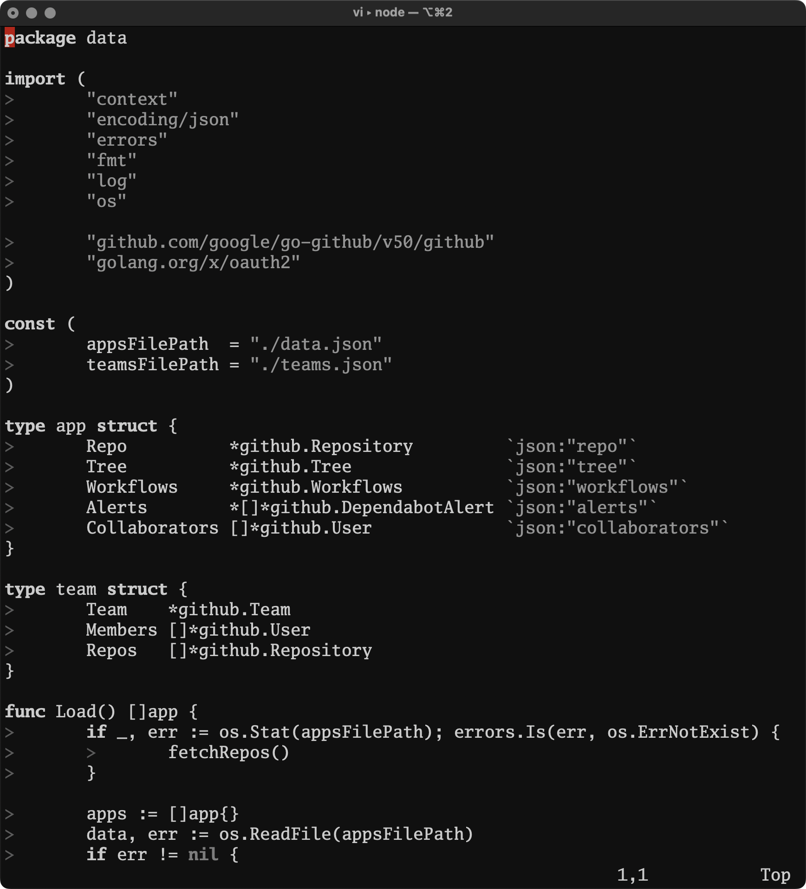

# Marquês de Itu
A simple, minimalistic, distraction-free theme for Vim. Since the time I lived in São Paulo at the bohemian Marquês de Itu street, I used for a long time the photo my friend @brunohenrique took as my background and become a bit obssessed with grayscale [setups](https://www.reddit.com/r/unixporn/comments/5kbkc1/i3wm_life_isnt_colorful_my_friend/).

_photo: @brunohenrique_

## Preview

### Golang

### Diff

## Resources

- Heavily inspired on https://github.com/Lokaltog/vim-monotone and therefore its inspirations
- https://michurin.github.io/xterm256-color-picker/
