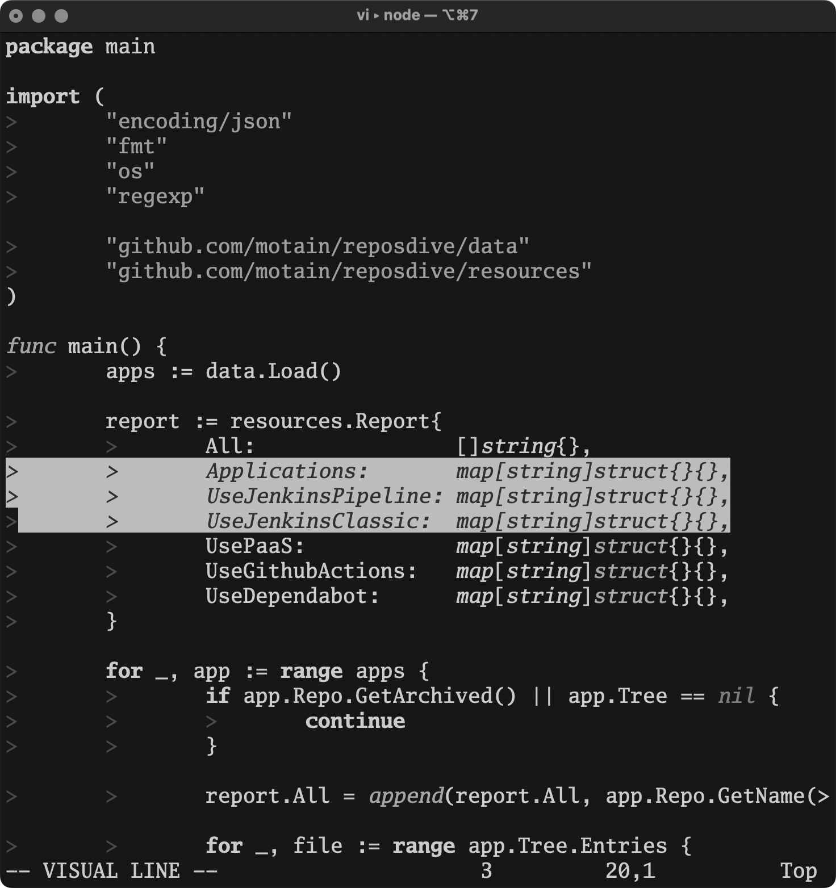

# Marquês de Itu

A simple, minimalistic, distraction-free theme for Vim. During my time living on the bohemian Marquês de Itu street in São Paulo, I used this photo by my friend @brunohenrique as my background for a long time and became obsessed with grayscale [setups](https://www.reddit.com/r/unixporn/comments/5kbkc1/i3wm_life_isnt_colorful_my_friend/) when I saw my other friend @cairesvs and his monochromatic editor theme­ it was the perfect match.


_photo: @brunohenrique_

## About

This is a 256-color theme, but also has the GUI colors. It means that it works great with on Terminal.app,  which only supports 256 colors, but also with more modern terminals like iTerm2, Alacritty, Kitty, etc that support `set termguicolors`.

It has both light and dark background support that follows your background setting, and a few configuration options to customize the look and feel.

## Configuration

### Search Highlight Style

By default, search highlights use a bright color (yellow for dark mode, orange for light mode) to make matches ultra easy to spot. You can switch to a more subtle monochromatic style by adding this to your `.vimrc`:

```vim
let g:marques_search_highlight_style = 'monochrome'
```

Available options:
- `'default'` - Bright yellow/orange highlights (default)
- `'monochrome'` - Subtle grayscale highlights

### Opaque Background

By default, the theme uses transparent backgrounds that inherit from your terminal. If you have paddings or a transparent background in your terminal you probably want to use the default. If not, andyou prefer solid background colors, add this to your `.vimrc`:

```vim
let g:marques_opaque_background = 1
```

## Installation

### Vim

```
git clone https://github.com/brennovich/marques-de-itu.git ~/.vim/pack/plugins/start/marques-de-itu
```

Then set the colorscheme in your `.vimrc`:

```vim
" set background=light " Uncomment to force light mode
colorscheme marques-de-itu
```

### Ghostty

Copy the theme files to your Ghostty themes directory:

```bash
mkdir -p ~/.config/ghostty/themes
cp ~/.vim/pack/plugins/start/marques-de-itu/ghostty/marques-de-itu-dark ~/.config/ghostty/themes/
cp ~/.vim/pack/plugins/start/marques-de-itu/ghostty/marques-de-itu-light ~/.config/ghostty/themes/
```

Then set the theme in your Ghostty config (`~/.config/ghostty/config`):

**Automatic light/dark switching:**
```
theme = dark:marques-de-itu-dark,light:marques-de-itu-light
```

## Preview

### Golang



### Lua


### Makefile


### Markdown


### Zsh


### Diff


## Resources

- Heavily inspired by https://github.com/Lokaltog/vim-monotone and its inspirations
- https://michurin.github.io/xterm256-color-picker/
